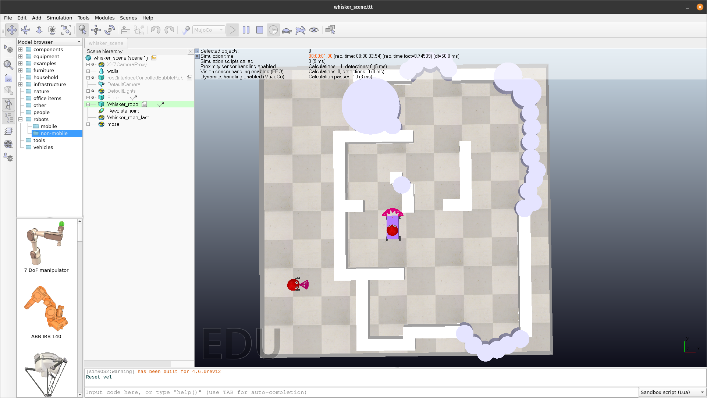
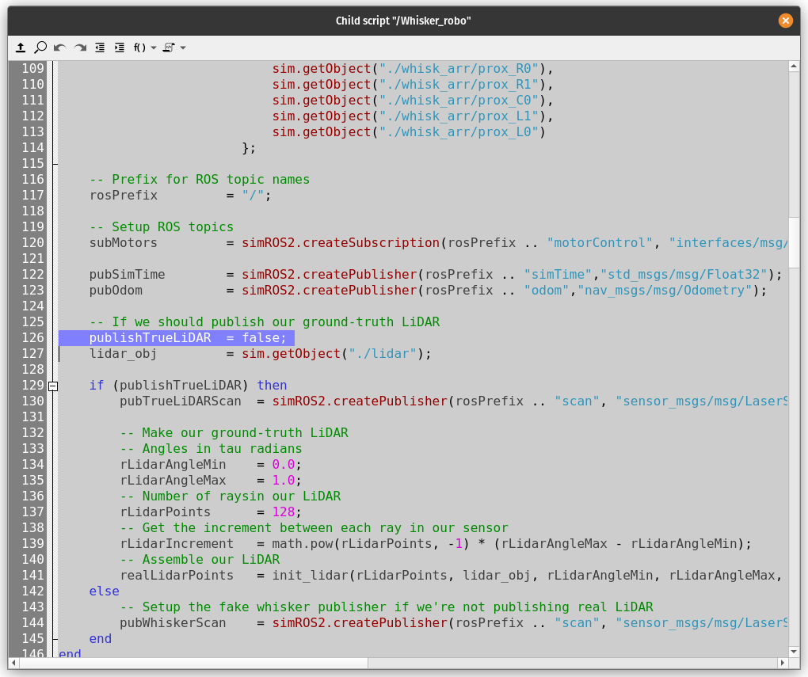

# ROS2 Whisker SLAM

An application of tactile SLAM using the [Coppelia Simulator](https://manual.coppeliarobotics.com/en/ros2Tutorial.htm).

This repository has two submodules. When cloning the repository use the `--recurse-submodules` argument:

```bash
# If you've not already cloned the repo, clone it like this
git clone git@github.com:nonbinary-duck/ros2-whisker-slam.git --recurse-submodules

# Or using HTTPS if you don't have SSH keys
git clone https://github.com/nonbinary-duck/ros2-whisker-slam.git --recurse-submodules

# The submodules are defined using a relative path when cloning submodules Git will use the same protocol as used to clone the repo

# If you've already cloned the repo and don't have the submodules cloned the submodule command can be used
git submodule update --recursive --init
```

- `./packages/ros2_interfaces`
    - This submodule is an ROS2 package containing a single interface for sending target velocities in a single command to the 4 differential drive robot in Coppelia
    - Please note that the submodule is checked out by default in a specific commit and this does not need to be changed 
- `./packages/sim_ros2_interface`
    - A fork of CoppeliaSim's ROS2 interface
    - This interface is modified to contain the custom `interfaces/msg/F64vel4` message type for use in Lua and presumably also Python
    - Note that to compile this submodule you need to have downloaded [Coppelia Simulate](https://www.coppeliarobotics.com/#download) and have `$COPPELIASIM_ROOT_DIR` exported
        - e.g. in your `~/.bashrc` if Bash is your shell:
        - `export COPPELIASIM_ROOT_DIR=/home/villanelle/.local/share/applications/appImages/CoppeliaSim_Edu_V4_6_0_rev10_Ubuntu22_04/`

## Dependencies

This project uses ROS2 Iron. It is not guaranteed that any other version of ROS2 will work. Please install ROS2 either by following the [ROS Iron docs](https://docs.ros.org/en/iron/Installation/Ubuntu-Install-Debians.html). Or just:

```bash
# Add universe
sudo apt install software-properties-common
sudo add-apt-repository universe

# Update our aptitude and install curl
# Ubuntu server 22.04 has curl and wget, but we do this for completeness
sudo apt update && sudo apt install curl

# curl the ros key
sudo curl -sSL https://raw.githubusercontent.com/ros/rosdistro/master/ros.key -o /usr/share/keyrings/ros-archive-keyring.gpg

# Add the ROS2 PPA (manually)
echo "deb [arch=$(dpkg --print-architecture) signed-by=/usr/share/keyrings/ros-archive-keyring.gpg] http://packages.ros.org/ros2/ubuntu $(. /etc/os-release && echo $UBUNTU_CODENAME) main" | sudo tee /etc/apt/sources.list.d/ros2.list > /dev/null

# Get that PPA for an update
sudo apt update
```

> Note that these instructions exclude the [locale instructions](https://docs.ros.org/en/iron/Installation/Ubuntu-Install-Debians.html#set-locale) from the ROS installation to enable UTF-8. You may want to view those instructions. They are excluded as it is an exception to not have UTF-8.

The above instructions assume you're using an Ubuntu-derivative operating system, but other OSes are supported by ROS2 and therefore will likely work.

```bash
# Install remaining dependencies
# Please paste me as a single line!
sudo apt install ros-iron-ros-base ros-dev-tools build-essential cmake pkg-config gcc python3 swig python3-pip git libgoogle-glog-dev ros-iron-tf2-tools ros-iron-tf2 ros-iron-tf-transformations ros-iron-nav2-bringup ros-iron-slam-toolbox ros-iron-moveit ros-iron-nav2-simple-commander ros-iron-rviz2

# The coppelia ros interface has some further dependencies mostly met by install gazebo
sudo apt install libactionlib-dev ros-iron-actionlib-msgs ros-iron-image-transport ros-iron-visualization-msgs ros-iron-gazebo-ros
```

As previously mentioned you need to have downloaded [Coppelia Simulate](https://www.coppeliarobotics.com/#download) and have `$COPPELIASIM_ROOT_DIR` exported, a path where the `coppeliaSim` executable file can be found, so that executing `$COPPELIASIM_ROOT_DIR/coppeliaSim` would launch coppelia.

```bash
# You can add this line to your ~/.bashrc, for example
export COPPELIASIM_ROOT_DIR=/home/villanelle/.local/share/applications/appImages/CoppeliaSim_Edu_V4_6_0_rev10_Ubuntu22_04/
```

## Building

One all dependencies have been met, the solution can be compiled:
```bash
# Make sure you've sourced ROS Iron in this shell
# It's also worth adding this to your bashrc
source /opt/ros/iron/setup.bash

# In the root directory of this repo, i.e. where this readme is located, execute colcon
# The symlink-install is optional but helps if developing
# First time executing this will take a while as the sim_ros2_interface package must be compiled
# Note that once the sim_ros2_interface has been built, the library gets automagically copied over to your $COPPELIASIM_ROOT_DIR and respects the symlink-install option
colcon build --symlink-install

# Source our packages
source install/setup.bash
```

## Running

Once all the packages have been successfully built use the following:
```bash
# This launches Coppelia, the nav2 stack, SLAM and our /cmd_vel to 4 diff drive controller
# You'll have to manually begin the simulation in Coppelia
# The use_whisker_params param is an optional argument which launches SLAM using the whisker param file
# If false, it will launch using the LiDAR param file which isn't useful for the whisking
# It defaults to True
ros2 launch whisker_utils sim_and_slam_bringup.py use_whisker_params:=True

# To see other params available by other packages use
ros2 launch whisker_utils sim_and_slam_bringup.py --show-args

# Since there is a controller for cmd_vel, we can use standard ROS tools like teleop_twist_joy and the nav2 navigation
# If you don't have a game controller or other joystick, there is a keyboard teleop package available too
# For example:
sudo apt install ros-iron-teleop-twist-joy ros-iron-teleop-twist-keyboard

ros2 launch teleop_twist_joy teleop-launch.py
```

If using the LiDAR edit line `126` in the Lua script on `/Whisker_robo` changing `false` to `true`. Other params for the ground-truth LiDAR can be found there and at the start of the file. To edit a scrip in Coppelia, double-click the script icon on an object.




